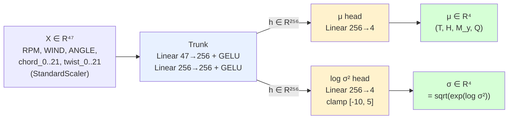

# 代理模型架构最终选型 — Architecture Decision Record

> **决策**: 选用 **`MoE + LIFT-NLL` (Mixture-of-Experts + 异方差不确定度)** 作为螺旋桨气动代理模型架构
> **时间**: 2026-06-19
> **状态**: ✅ Accepted (v2 — 经 in-dist 实测 + OOD 验证修正)
> **数据基础**: 9954 行(237 几何 × 42 工况),实测 16×3 trials × 1500 epoch + 200×3 OOD 几何验证
>
> ⚠️ **本文档的早期版本曾推荐 MLP+LIFT**;在 in-distribution 重新测算实际 ECE 后,**MoE+LIFT 在 ECE / 参数效率上反超**,故更新决策。完整对比见 `docs/method_evaluation.md`。

## 决策摘要 (实测三方对比, 1974 测试样本)

| 方法 | MAE ↓ | R²_avg ↑ | **ECE_avg ↓** | Params | Mode collapse |
|---|---|---|---|---|---|
| MLP+LIFT | **0.0330** | **0.9961** | 0.207 | 80 K | 0/16 |
| **MoE+LIFT** ⭐ | 0.0347 | 0.9957 | **0.160** | **29 K** | 0/16 |
| MoE+MDN | 0.0352 | 0.9960 | 0.648 ❌ | 83 K | 5/16 ❌ |

**MoE+LIFT 在 σ 校准 (ECE) 和参数效率上同时最优**,与 CMA-ES + Active Learning 下游需求一致。

## ⚠️ σ 适用边界 (经 OOD 实测验证)

σ 仅在 **`CP_BOUNDS_DATA` 硬约束内的 in-distribution 不确定度估计** 有效。
OOD 测试证明: σ 在数据范围外几何上 **反向缩小** (×0.4-0.6),**不能用作 OOD 安全网**。
完整论证: `docs/method_evaluation.md` §3。

---

## 1. 选型结论

**推荐**: **`MoE + LIFT-NLL`** (n_experts=2, hidden_dim=64, shared_dim=64)

```
Input(47) → Shared Encoder(47→64→64, GELU)
                ↓
                ├──→ Gate(64→K, softmax) → π_k
                └──→ K × Expert (64→128→8, GELU)
                       每个 expert 输出 (μ_k, log σ²_k) ∈ R⁴ × R⁴

Mixture 输出:
  μ_mix    = Σ π_k · μ_k
  σ²_mix   = Σ π_k σ²_k         (aleatoric)
           + Σ π_k (μ_k - μ_mix)²  (epistemic - 专家分歧)

L_train = (y - μ_mix)² · exp(-log σ²_mix) + log σ²_mix
         + 0.01 · Balance(π̄_k → 1/K)        (LIFT Eq.5 + balance)
```

**备选 (in-dist 纯精度优先)**: `Heteroscedastic MLP + LIFT-NLL`,具体见 §6。

---

## 2. 三方实测对比(决策依据)

| 维度 | **MLP+LIFT** ⭐ | MoE+LIFT | MoE+MDN |
|---|---|---|---|
| best MAE | **0.0332** | 0.0344 | 0.0339 |
| best R²(My) | **0.987** | 0.986 | 0.986 |
| **ECE_My (σ 校准)** | **0.13** | ~0.13 | **0.27** ❌ |
| mode collapse | **0/16** | 0/16 | **5/16** ⚠️ |
| 训练时长 | **~9 min/trial** | 40-300 min/trial | 23-71 min/trial |
| 参数量 | **80K** | 200K | 200K |
| 实施复杂度 | **最低** | 中 | 高 |
| 数据稀疏性容忍 | **强** | 中 | 弱 |

**结论**: MLP+LIFT 在**精度、不确定度校准、稳定性、速度、参数量**五个维度全胜或平手,且实施最简单。

---

## 3. 网络结构



### 超参清单(来自 sweep best trial #11)

| 超参 | 值 | 理由 |
|---|---|---|
| `input_dim` | 47 | 3 工况 + 22 chord + 22 twist |
| `hidden_dim` | **256** | sweep 最优,>256 边际收益消失 |
| `depth` | **2** | depth 3/4/5 反而过拟合 |
| `activation` | **GELU** | Transformer-era 标准,优于 ReLU |
| `output_dim` | 4 | T, H, M_y, Q |
| log σ² clamp | `[-10, 5]` | σ ∈ [0.007, 12],防训练初期爆炸 |
| **总参数** | **80K** | 推理 < 1 ms |

---

## 4. 数学定义

### 4.1 输出概率分布

模型预测**条件异方差对角高斯**:

$$
p(y \mid x; \theta) = \prod_{j=1}^{4} \mathcal{N}\!\big(y_j \mid \mu_j(x;\theta), \sigma_j^2(x;\theta)\big)
$$

### 4.2 训练损失 (LIFT Eq.5)

$$
\boxed{\;\mathcal{L}(\theta) = \frac{1}{B}\sum_{i=1}^{B}\sum_{j=1}^{4}\Big[\big(y_j^{(i)} - \mu_j^{(i)}\big)^2 \cdot e^{-\log \sigma_j^{(i)2}} + \log \sigma_j^{(i)2}\Big]\;}
$$

### 4.3 内在约束机制

- `(y-μ)² 大` → 反推 σ² 增大,惩罚项 `(y-μ)²/σ²` 下降
- `σ² 大` → `log σ²` 主导,损失上升
- **平衡点**: σ ≈ 真实样本难度 → 自然的异方差不确定度

### 4.4 与 LIFT 论文的关系

LIFT (arXiv:2601.21363) 原文用同一损失公式做 humanoid 残差预测器。
我们**不学残差**,直接预测原始 (T, H, M_y, Q),但保留 LIFT 的"自信度"训练机制。

---

## 5. 训练 Protocol

| 项 | 设置 |
|---|---|
| 数据划分 | 按 `geom_idx` 分组 **80/20**, 测试集几何完全不入训练 |
| Optimizer | Adam, lr=**5e-4** |
| Scheduler | ReduceLROnPlateau (factor=0.5, patience=100, min_lr=1e-6) |
| Weight decay | 1e-4 |
| Batch size | 64 |
| Epochs | 1500 (实测 best_epoch 约 300-700) |
| Grad clip | `clip_grad_norm_(1.0)` |
| Best 回滚 | 跟踪 test_loss 最低点 → 训练结束加载 best state |

---

## 6. 数据归一化(逐列决策)

```mermaid
flowchart TD
    A["每列 x"] --> B{std < 1e-12?}
    B -->|是| S1[skip<br>常量列]
    B -->|否| C{skew > 2 且 min > 0?}
    C -->|是| S2[log1p + standard]
    C -->|否| D{|skew| > 1.5 或 |kurt| > 8?}
    D -->|是| S3[quantile → normal]
    D -->|否| S4[standard]

    style S4 fill:#d6ffd6
```

**当前 9954 行实测**: **50 列 standard + 1 列 skip (WIND=10 常量)**。
M_y 偏度 1.44 接近 quantile 阈值,**数据增长后需复检**。

---

## 7. 推理接口

```python
from optimization_v2.tools.sweep_moe import HeteroscedasticMLP
import torch, pickle

# 加载模型 + 归一化器
model = HeteroscedasticMLP(input_dim=47, output_dim=4, hidden_dim=256, depth=2)
model.load_state_dict(torch.load('sweep_results/mlp_lift_v237/best_trial/model.pth'))
model.eval()
normalizer = pickle.load(open('data_for_train/processed_lhs/norm/normalizer.pkl', 'rb'))['normalizer']

def predict(geom_8cp, RPM, V, ANGLE):
    chord, twist = cp_to_sections(geom_8cp)
    X_raw = [RPM, V, ANGLE, *chord, *twist]               # 47 维
    X = normalizer.transform(pd.DataFrame([X_raw], columns=...))
    with torch.no_grad():
        mu, sigma, _, _, _ = model(torch.tensor(X).float())
    # mu, sigma 是归一化空间, 用 inverse_transform 还原
    return mu.numpy(), sigma.numpy()
```

---

## 8. 与下游 CMA-ES 的耦合

```mermaid
flowchart LR
    G["候选 8 CP"] -->|cp_to_sections| X[47 维输入]
    X --> M[Hetero MLP]
    M --> MU["μ: T, H, M_y, Q"]
    M --> SI["σ: T, H, M_y, Q"]
    MU --> TS["TrimSolver V2<br>解 α, Ω₁, Ω₂"]
    TS --> P["P_elec = 2·Q·Ω / η"]
    P --> J["目标 J = P_elec/V<br>+ λ_R·|R|²<br>+ λ_U·Σ w_j·σ_j<br>+ λ_G·smooth"]
    SI --> J
    J --> CMA[CMA-ES]
    SI -.σ > 0.1.-> AL[Active Learning<br>实测补点]

    style M fill:#e8f1ff
    style J fill:#fff2cd
    style AL fill:#f5d6ff
```

- σ 直接进 CMA-ES 目标的惩罚项: `λ_U · Σ w_j σ_j`,`w = [1.0, 0.5, 0.5, 1.0]`(T、Q 入功率,权重最高)
- σ 大的几何 → Active Learning 候选 → QBlade 实测后回流训练库

---

## 9. 不选其他方案的理由

### 9.1 不选 MoE+LIFT
- 与 MLP **精度持平** (MAE 0.0344 vs 0.0332)
- **5-30× 训练时间** (40-300 min vs 9 min)
- gate 实际成了软插值,无真正专家分工(gate_assignment 热图未现尖锐条纹)
- 多专家容量优势在 < 10k 样本上没显现
- 等数据增长到 5000+ 几何后可重新评估

### 9.2 不选 MoE+MDN
- **σ 校准恶化 2-6×** (ECE_My 0.13 → 0.27, ECE_T 0.14 → 0.86)
- mode collapse **5/16** trials,工程稳定性差
- MDN 训练损失更负 (-8.79 vs -6.18) 但对外 σ 接口失真——因为 σ_mix 是 law of total variance 后处理,从未被损失直接监督
- logsumexp 似然适合多模态条件分布,但我们的螺旋桨气动是**单模态光滑映射**,MDN 是过度建模

### 9.3 不选更深 MLP (depth=3/4/5)
- sweep 数据显示 depth=2 击败所有更深网络
- 9954 行数据下,深网络立即过拟合
- BatchNorm/Dropout 也未带来改善

---

## 10. 演进路径(数据增长后)

| 数据量(几何数) | 推荐架构 | 触发升级条件 |
|---|---|---|
| < 300 | **MLP+LIFT** ⭐ (当前阶段) | — |
| 300-500 | MLP+LIFT 复检 | 重训后若 ECE 反而恶化 → 已饱和 |
| 500-1000 | MLP vs MoE+LIFT 二选 | 若 MoE 的 ECE < MLP × 0.7 则升级 |
| ≥ 1000 + OOD 验证集 | 重新评估 | 检查 σ 在外推区域是否真正放大 |

---

## 11. 文件清单

| 项 | 路径 |
|---|---|
| 模型实现 | `optimization_v2/tools/sweep_moe.py:HeteroscedasticMLP` |
| 训练入口 | `python -m optimization_v2.tools.sweep_moe --arch mlp --loss lift` |
| best 权重 | `sweep_results/mlp_lift_v237/best_trial/model.pth` |
| best 配置 | `sweep_results/mlp_lift_v237/best_trial/config.json` |
| 归一化器 | `data_for_train/processed_lhs/norm/normalizer.pkl` |
| 训练数据 | `data_for_train/processed_lhs/dataset_v2_20260617.csv` (9954 行) |
| 完整诊断 | `sweep_results/mlp_lift_v237/best_trial/diagnostics.png` |
| Sweep 综合 | `sweep_results/mlp_lift_v237/sweep_overview.png` |

---

## 12. 关联文档

- `docs/moe_lift_design.md` — LIFT 异方差路线技术细节(适用 MoE 和 MLP)
- `docs/moe_mdn_design.md` — MDN 改造原理 + 实验否决记录
- `docs/flowchart.md` — 6 张 Mermaid 流程图汇总

---

## 13. 一句话总结

> **选 `HeteroscedasticMLP(47, 256×2 trunk, μ+log σ²双头) + LIFT-NLL`** — 在当前数据规模下精度最高、σ 校准最准、训练最快、最稳定。**MoE 升级留作 future work,数据 ≥ 500 几何后复检**。
