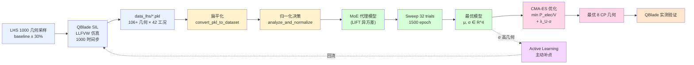
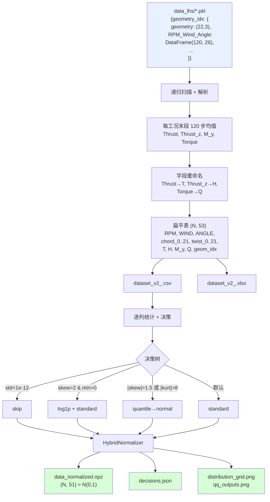
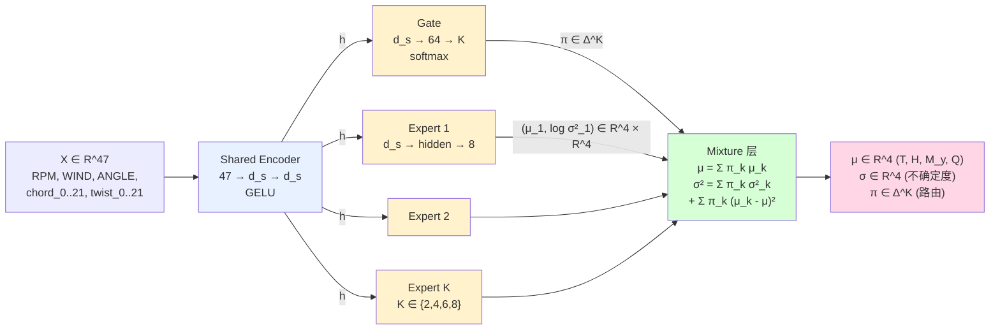
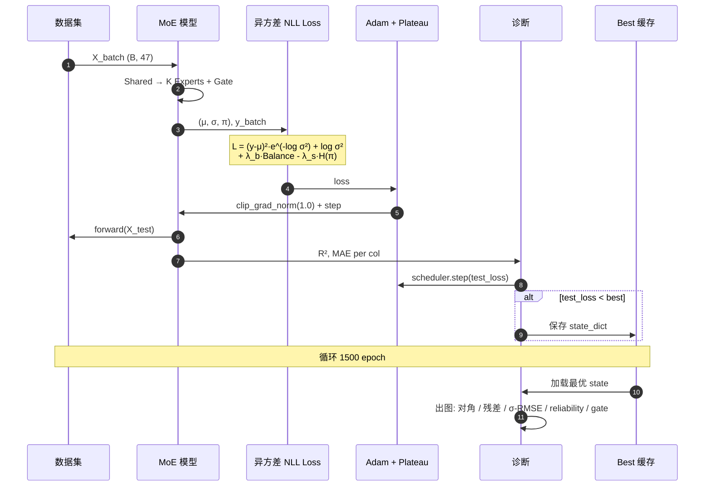
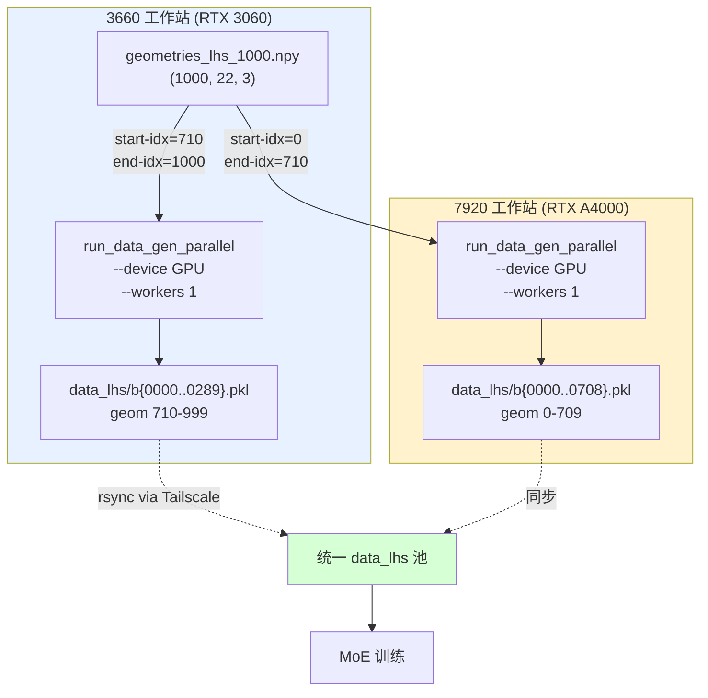

# 项目技术路线流程图

> 复制下面任意一段 Mermaid 代码到 GitHub / VSCode / Typora / draw.io / mermaid.live 即可渲染为 PNG/SVG 用于答辩 PPT。

---

## A. 端到端总览(适合答辩首页)



---

## B. 数据流(从 pkl 到训练矩阵)



---

## C. MoE 模型结构(LIFT 异方差)



---

## D. 训练循环



---

## E. 不确定度产出与下游耦合

```mermaid
flowchart LR
    G["候选几何<br>8 CP"] -->|"cp_to_sections<br>(B-Spline)"| X["47 维输入"]
    X --> MoE["MoE 推理"]
    MoE --> MU["μ:<br>T, H, M_y, Q"]
    MoE --> SI["σ:<br>T, H, M_y, Q"]
    MU --> TRIM["TrimSolver V2<br>解 (α, Ω_1, Ω_2)<br>使 Fx=Fz=M_y=0"]
    TRIM --> POW["P_elec = 2·Q·Ω / η<br>η = 0.80"]
    POW --> OBJ["目标:<br>J = P_elec/V<br>+ λ_R·|R|²<br>+ λ_U·Σ w_j·σ_j<br>+ λ_G·smoothness"]
    SI --> OBJ
    OBJ --> CMA["CMA-ES<br>popsize=16<br>maxiter=200"]
    CMA --> BEST["最优 CP"]

    SI -.σ_j > σ_max=0.1.-> AL["Active Learning<br>记录候选"]
    AL -->|每轮 N 个| QB["QBlade 实测"]
    QB --> NEW["新 pkl"]
    NEW -.合并.-> MoE

    style MoE fill:#d6ffd6
    style OBJ fill:#fff2cd
    style CMA fill:#ffd6e6
    style BEST fill:#ffd6e6
    style AL fill:#f5d6ff
```

---

## F. 双机仿真分工(系统层)



---

## 使用提示

1. **导出 PNG/SVG**: 复制 mermaid 代码到 https://mermaid.live → 右上角下载。
2. **批量渲染**: VSCode 装 `Markdown Preview Mermaid Support` 后,任意 .md 文件按 `Ctrl/Cmd+K V` 可看预览,右键导出。
3. **答辩 PPT 用法**: 总览图 A 放第 1 页(技术路线); B / C 放数据/模型章节; D / E 放训练/优化章节; F 用于工程实现部分。
