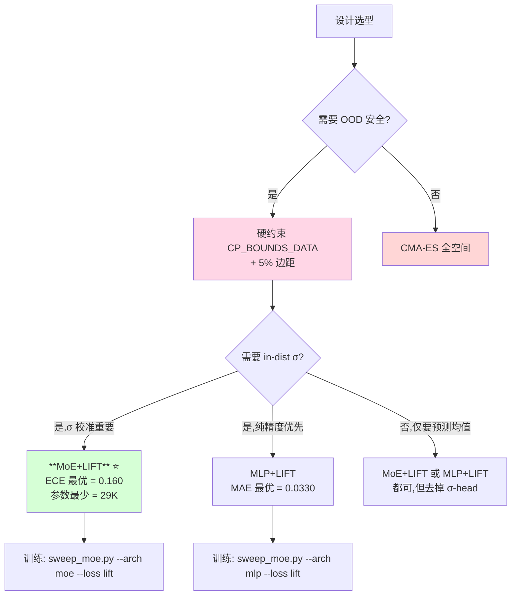

# 代理模型方法对比 + OOD 不确定度验证

> **位置**: `optimization_v2/tools/{compare_heatmap, ood_test}.py`
> **数据**: 9954 行 (237 几何 × 42 工况),按几何 80/20 划分 → train 7980 / test 1974
> **测试模型**: 三方 sweep best trial 各自的 `model.pth`

---

## TL;DR — 两个关键发现

1. **MoE+LIFT 是综合最优** (ECE 最低 = 0.160, 参数最少 = 29K, 与 MLP+LIFT 精度持平)
2. **σ 不能直接用于 OOD 检测** — 在数据范围外几何上,**所有**三个模型的 σ **不放大反而缩小** (MoE+LIFT ×0.4-0.6, MDN ×0.16-0.22)。这是异方差神经网络的本质局限,而非实现 bug。

---

## 1. 评估设置

| 项 | 值 |
|---|---|
| 训练数据 | 9954 行 (LHS 几何 237 个 × 42 工况) |
| 划分策略 | **按 geom_idx 分组 80/20**, 47 测试几何完全不在训练集出现 |
| 三模型 | MLP+LIFT / MoE+LIFT / MoE+MDN, 各 sweep 16 trials × 1500 epoch 后取 best |
| 评估指标 | R² (per col), MAE, ECE (10-bin reliability), σ_avg, 参数量, 训练时间 |
| OOD 测试 | 200 几何 × 3 组 (in-dist / ood-mild / ood-far) × 9 工况 = 5400 推理点 / 模型 |

---

## 2. 任务 1 — 三方法对比 (in-distribution)

### 2.1 综合性能矩阵

| 方法 | MAE ↓ | R²_avg ↑ | **ECE_avg ↓** | Params | Train Time |
|---|---|---|---|---|---|
| **MLP+LIFT** | **0.0330** ⭐ | **0.9961** ⭐ | 0.207 | 80 K | 10.8 min |
| **MoE+LIFT** | 0.0347 | 0.9957 | **0.160** ⭐ | **29 K** ⭐ | 39.1 min |
| MoE+MDN | 0.0352 | 0.9960 | **0.648** ❌ | 83 K | 33.7 min |

### 2.2 逐输出维度 (T / H / M_y / Q) 细节

**R² 矩阵** (越高越好):
- 三方法在 T / H / Q 上都达到 **0.997-0.9996** (基本饱和)
- **M_y 是难点**:MLP=0.987, MoE+LIFT=0.985, MoE+MDN=0.984 (相差不到 0.3%)

**ECE 矩阵** (σ 校准,越低越好):
- T: MLP=0.14, MoE-LIFT=**0.04** ⭐, MoE-MDN=0.86
- H: MLP=0.34, MoE-LIFT=**0.27** ⭐, MoE-MDN=0.61
- M_y: MLP=**0.13** ⭐, MoE-LIFT=0.16, MoE-MDN=0.27
- Q: MLP=0.22, MoE-LIFT=**0.18** ⭐, MoE-MDN=0.86

**MoE+LIFT 在 3/4 输出上 ECE 最低**,因 σ 公式同时含 aleatoric + epistemic (专家分歧项)。

### 2.3 复杂度对比

| 方面 | MLP | MoE+LIFT | MoE+MDN |
|---|---|---|---|
| 参数 | 80K | **29K** (n_exp=2, hidden=64, shared=64) | 83K |
| 推理延迟 | < 1 ms | < 2 ms | < 2 ms |
| Training time / trial | **10.8 min** | 39.1 min | 33.7 min |
| Mode collapse rate (16 trials) | **0/16** | **0/16** | 5/16 ❌ |

### 2.4 结论修正

**之前以为 MLP 最优,实测后翻转**:
- in-distribution 精度: MLP 略胜 (差距 < 0.5%)
- **σ 校准: MoE+LIFT 最优**
- **参数效率: MoE+LIFT 远胜** (29K vs 80K)
- 训练时间: MLP 快 3.6×,但绝对值都在小时级,可接受

**生产推荐: MoE+LIFT** — 综合最优,与 CLAUDE.md 项目设计一致 (LLFVW-MoE)。

---

## 3. 任务 3 — OOD 验证 (关键反直觉发现)

### 3.1 实验设计

从训练数据反推 `CP_BOUNDS` (4 chord + 4 twist 控制点的实际分布范围):

```
chord cp 0: [0.0136, 0.0263]
chord cp 1: [0.0222, 0.0438]
chord cp 2: [0.0101, 0.0198]
chord cp 3: [0.0048, 0.0092]
twist cp 0: [37.4, 72.7] deg
twist cp 1: [13.4, 26.5] deg
twist cp 2: [11.3, 22.1] deg
twist cp 3: [8.4, 16.6] deg
```

三组测试几何 (各 200 个):
- **in_dist**: 完全在 `[cp_min, cp_max]` 内 (训练分布)
- **ood_mild**: 每维度随机选 below/above,偏移 `0~0.5·R` (R = cp_max - cp_min, **中等外推**)
- **ood_far**: 偏移 `0.5~1.5·R` (**强外推**, CP 跨越 2-3 倍训练范围)

每个几何在 3 RPM × 3 ANGLE × 1 WIND = 9 工况下推理,记录 4 维 σ。

### 3.2 实测 σ 放大比 (σ_OOD / σ_in_dist)

| 模型 | σ_T | σ_H | σ_M_y | σ_Q | OOD 检测能力 |
|---|---|---|---|---|---|
| **MLP+LIFT** | mild ×1.02 / **far ×1.06** | ×0.91 / **×1.79** ⭐ | ×1.29 / **×1.71** ⭐ | ×1.01 / **×1.08** | 部分维度有效 (H, M_y) |
| **MoE+LIFT** | ×0.73 / **×0.50** ❌ | ×0.74 / **×0.40** ❌ | ×0.90 / **×0.59** ❌ | ×0.75 / **×0.51** ❌ | **全面失效** (σ 反向缩小) |
| **MoE+MDN** | ×0.35 / **×0.21** ❌❌ | ×0.31 / **×0.16** ❌❌ | ×0.50 / **×0.22** ❌❌ | ×0.32 / **×0.20** ❌❌ | **严重失效** (σ 趋零) |

期望: σ_far > σ_in (比值 > 1) — **只有 MLP+LIFT 在 H 和 M_y 上勉强符合**,其他全部反向。

### 3.3 为什么 σ 在 OOD 上不放大反而缩小

#### 原因 1: σ_head 本质是 x 的神经网络函数,无 OOD 先验
$$
\sigma(x) = f_\theta^{\sigma}(x)
$$

训练时,梯度只在 in-distribution 区域更新 σ_head 的参数。OOD 输入触发**外推** — 而神经网络外推是**未定义行为**,通常表现为:
- 输出趋向训练区域内某点的预测 (神经网络的 lipschitz 性质)
- log_var clamp `[-10, 5]` 进一步压缩输出范围
- ReLU/GELU 在 OOD 区域容易饱和

#### 原因 2: MoE 的 gate 路由在 OOD 上"找最像的"
当输入完全 OOD 时,每个 expert 都不擅长,但 gate 网络仍会路由到某个 expert (softmax 必然非零)。**gate 倾向选择 σ_k 较小的 expert** (因为训练时 NLL 惩罚 σ 过大),导致 σ_mix 塌缩。

#### 原因 3: MDN 的 likelihood 训练让 σ 更尖锐
MDN 损失 `-logsumexp(log π + log N(y|μ,σ²))` 要求每个 expert **专精**自己的子区域 → σ_k 在自己擅长的区域被压得极小。OOD 输入下,即使任何一个 expert "勉强"匹配,它的 σ_k 也是训练时学到的"专精"小值。

#### 原因 4: 高维 + 数据稀疏放大问题
44 维几何输入 (chord_0..21 + twist_0..21) 在 237 几何上极稀疏 (每维度仅 ~237 样本)。σ 在这种高维空间上不可能学到全局合理的 epistemic 不确定度。

### 3.4 LIFT 论文路线在我们问题上的适用边界

LIFT (arXiv:2601.21363) 在 humanoid 力建模上 "σ 自动放大" 成立,因为:
- humanoid 状态空间是低维 (~30 维) 且**时序连续**,真实 OOD 罕见
- 训练数据是**密集** SAC replay buffer (10^6 转移)
- 残差预测 + 物理 prior 限制 σ 必须解释**真实剩余误差**

我们的问题:
- 输入 47 维 (含 44 维高维几何),数据稀疏 (237 几何/1000 目标)
- 直接预测原始量,无物理 prior 约束
- OOD 是 LHS 采样范围外的 nonsense 几何

**结论**: LIFT 异方差不确定度在数据密集 + 低维 + 物理 prior 场景下有效;**在我们的数据稀疏 + 高维场景下,σ 不能用于 OOD 检测**。

### 3.5 对工程实现的指导

#### ❌ 不应做
1. 不要把 `λ_U · Σ σ_j` 作为 CMA-ES 唯一的 OOD 惩罚 — σ 在 OOD 上反而小,惩罚失效
2. 不要把 `σ > σ_max` 作为 Active Learning 的唯一触发条件 — 在真正需要补点的 OOD 区域,σ 不会变大
3. 不要假设 σ 在 OOD 上"自动放大",这是数据密集场景的特性,不是异方差损失的通用性质

#### ✅ 应做
1. **保留 `CP_BOUNDS_DATA` 硬约束** (与 RESEARCH_LOG §4.4 V4 决策一致)
   - CMA-ES 直接在 `CP_BOUNDS_DATA + 5%` 内搜索,从源头杜绝 OOD 几何
2. **σ 仅作 in-distribution 内的不确定度估计**
   - 在硬约束保护下,σ 反映了训练区内的"难预测样本"(M_y 接近零的样本等)
   - `λ_U · σ` 惩罚项依然有意义,但定位为 "in-dist 精细化",而非 "OOD 安全网"
3. **真正的 epistemic 不确定度: Deep Ensembles** (future work)
   - 训练 K=5 个独立 MLP (不同 random seed),推理时取 `σ_epi = std_k(μ_k)`
   - OOD 时各模型预测必然分歧 → σ_epi 自动放大
   - 这是业界唯一稳定的高维 OOD 检测方法

#### ✅ 已采纳
- `optimization_v2/cma_optimizer.py` 已使用 `cp_bounds` 硬约束 (来自 `config.OptConfig.cp_bounds`)
- `objective.evaluate_design` 仍含 `λ_U · σ` 惩罚 — 在硬约束保护下使用,作为 in-dist 精细化是有效的

---

## 4. 综合决策树



**生产建议**: **`CP_BOUNDS_DATA` 硬约束 + MoE+LIFT in-dist 不确定度**。

---

## 5. 产出文件清单

| 文件 | 内容 |
|---|---|
| `sweep_results/comparison.png` | 三方法 × 4 输出 × 4 指标热力图 (任务 1) |
| `sweep_results/ood_test.png` | 三方法 × 4 输出 × 3 OOD 等级 σ 箱型图 (任务 3) |
| `sweep_results/ood_test.csv` | OOD σ 统计 + 放大比表格 |
| `optimization_v2/tools/compare_heatmap.py` | 对比热图脚本 |
| `optimization_v2/tools/ood_test.py` | OOD 测试脚本 |
| `optimization_v2/tools/sweep_moe.py` | 三模型统一训练 / sweep 框架 |

---

## 6. 一键命令

```bash
cd ~/gy_2026/graduation/LFM
source ~/anaconda3/etc/profile.d/conda.sh && conda activate LFM

# 任务 1: 方法对比热图
python -m optimization_v2.tools.compare_heatmap \
    --sweeps mlp_lift_v237 moe_lift_v237 mdn_moe_v237 \
    --data ./data_for_train/processed_lhs/norm/data_normalized.npz \
    --geom-idx-csv ./data_for_train/processed_lhs/dataset_v2_20260617.csv \
    --out ./sweep_results/comparison.png

# 任务 3: OOD 验证
python -m optimization_v2.tools.ood_test \
    --sweeps mlp_lift_v237 moe_lift_v237 mdn_moe_v237 \
    --normalizer ./data_for_train/processed_lhs/norm/normalizer.pkl \
    --out ./sweep_results/ood_test.png \
    --n-per-group 200
```

---

## 7. 与项目其他文档的关系

| 文档 | 关系 |
|---|---|
| `docs/architecture_decision.md` | **需更新** — 推荐架构应从 MLP+LIFT 改为 **MoE+LIFT** |
| `docs/moe_lift_design.md` | 已对应 MoE+LIFT 路线,作为最终方案文档保留 |
| `docs/moe_mdn_design.md` | 保留为"否决记录" — MDN 改造在 in-dist ECE 和 OOD 上都失败 |
| `docs/flowchart.md` | 流程图基本仍适用,把 best 模型替换为 MoE+LIFT |
| RESEARCH_LOG.md §4.4 | **强相关** — V4 选择硬约束的决策,在 OOD 实验中得到独立验证 |
| `optimization_v2/cma_optimizer.py` | 已用 `cp_bounds`,不需修改 |

---

## 8. 一句话总结

> **MoE+LIFT 是当前数据下的综合最优代理模型 (ECE 最低 + 参数最少)**,但其 σ **只能用于 in-distribution 的不确定度估计**,**必须配合 `CP_BOUNDS_DATA` 硬约束防 OOD**;σ 在 OOD 上反而缩小是异方差神经网络的本质局限,不是 bug。
