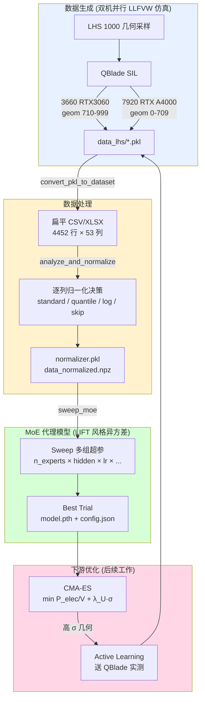
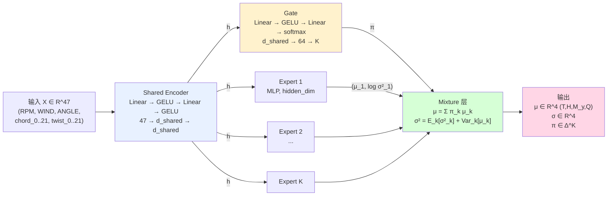
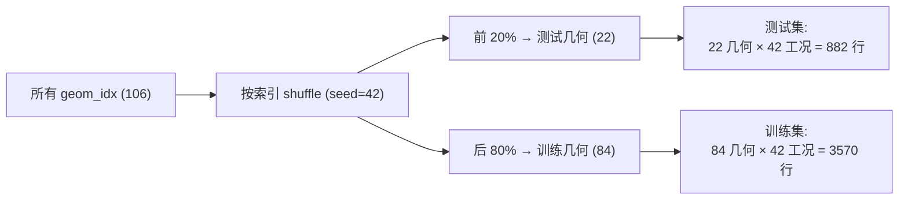
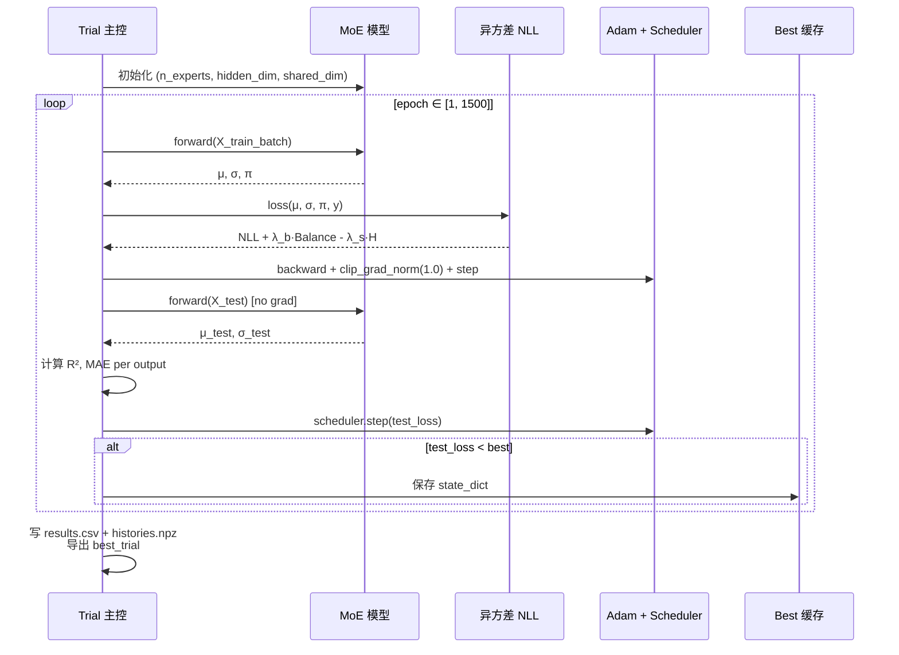
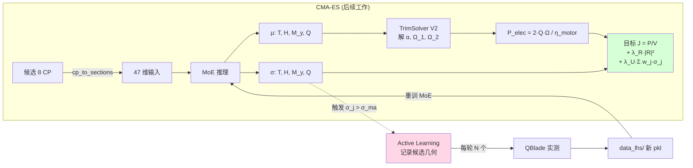

# 基于 MoE 代理模型的螺旋桨气动外形优化 — 技术路线

> **关键模块**: `optimization_v2/tools/{convert_pkl_to_dataset, analyze_and_normalize, sweep_moe}.py`
> **数据**: `data_for_train/data_lhs/*.pkl` (LLFVW 仿真)
> **当前样本**: 106 个 LHS 采样几何 × 42 工况 = **4452 条**(持续生成,目标 1000 几何)

---

## 1. 问题定义

复杂风场下无人机螺旋桨气动外形优化问题:在巡航工况 (V=10 m/s) 下,优化叶片几何 (8 个 B-Spline 控制点 = 4 弦长 + 4 扭角),使单位距离能耗 `P_elec / V` 最小,同时满足配平约束 `Fx=0, Fz=0, M_y=0`。

直接调用 LLFVW (Lifting-Line Free Vortex Wake) 仿真器评估每个候选几何过于昂贵 (单几何 42 工况 ≈ 1.1 小时 / GPU)。因此训练一个**代理模型**取代仿真,把单次评估从小时降到毫秒。

代理模型的核心需求:
1. **预测精度**: 输出 `[T, H, M_y, Q]` 四个力 / 力矩与真实 LLFVW 一致。
2. **不确定度量化**: 输出 `σ`,衡量预测可信度,以便:
   - CMA-ES 优化器**主动避开**模型不熟悉的几何 (惩罚项)。
   - 触发**主动学习**,把高 σ 的几何送回 LLFVW 实测,闭环补数据。

---

## 2. 整体技术路线



---

## 3. 数据采集与处理

### 3.1 LHS 几何采样 + LLFVW 仿真
- 8 维设计变量空间 `[chord_cp_0..3, twist_cp_0..3]`,以 baseline ± 30% 作上下界做 1000 点 LHS 采样。
- 每个几何在 6 RPM × 7 ANGLE = **42 工况** 下用 QBlade SIL (LLFVW, 1000 时间步) 仿真,取末段 120 步均值作为稳态输出。
- 输出: `data_lhs/<file>.pkl`,每文件含 `{geometry_<idx>: {geometry: (22,3), RPMx_Windy_Anglez: DataFrame(120, 26), ...}}`。

### 3.2 扁平化 (`convert_pkl_to_dataset.py`)
递归扫描 pkl,把树状结构压平成行级表:

| 列组 | 列数 | 含义 |
|---|---|---|
| 工况 | 3 | `RPM, WIND, ANGLE` |
| 几何 | 44 | `chord_0..21, twist_0..21` (沿径向 22 截面) |
| 输出 | 4 | `T=Thrust, H=Thrust_z, M_y, Q=Torque` |
| 索引 | 2 | `geom_idx, source_file` (审计用) |

字段命名遵循 V2 schema (`T/H/M_y/Q`),对应物理量在 Ye 等人 LLFVW 文献中的标记。

### 3.3 归一化决策 (`analyze_and_normalize.py`)
按统计量自动给每列选归一化方式,保证模型输入近似 N(0, 1):

```mermaid
flowchart TD
    A[列 x: 计算 stats] --> B{std < 1e-12?}
    B -->|是| S1[skip<br>常量列, 无信息]
    B -->|否| C{skew > 2 且 min > 0?}
    C -->|是| S2[log1p + standard<br>强右偏长尾]
    C -->|否| D{|skew| > 1.5 或 |kurt| > 8?}
    D -->|是| S3[quantile → normal<br>重尾]
    D -->|否| E{离散网格?<br>nunique≤20, nunique/n<5%}
    E -->|是| S4[standard]
    E -->|否| S5[standard<br>默认]

    style S1 fill:#ffd6d6
    style S2 fill:#fff2cd
    style S3 fill:#fff2cd
    style S4 fill:#d6ffd6
    style S5 fill:#d6ffd6
```

**4452 样本上的实际决策**:50 列 `standard` + 1 列 `skip` (WIND=10 常量)。M_y 偏度 1.44 / 峰度 4.02 处于 `quantile` 阈值边缘,样本数增长后会复检。

---

## 4. MoE 代理模型架构

### 4.1 设计思路

螺旋桨气动量在 `(RPM, V, α)` 工况空间和几何空间中**全局光滑但局部各向异性** — 例如低转速大攻角下的失速区域与正常工作区物理机制不同,小翼尖弦长附近又有强 3D 效应。

为了让模型在不同区域各擅其长:
- **共享编码器** (Shared Encoder) 抽取通用表征 `h ∈ R^d_shared`。
- **K 个并行专家** (Experts),每个 expert 是独立 MLP,在 `h` 上输出该专家的 `(μ_k, log σ²_k)`。
- **门控网络** (Gate) 也读 `h`,输出 K 维 softmax 权重 `π`,决定每个样本被分到哪些专家上。

借鉴 LIFT (arXiv:2601.21363) 在人形机器人世界模型中的不确定度量化机制:
- 每个 expert 同时输出**均值与对数方差** (heteroscedastic head)。
- 训练用**异方差 NLL**,模型被迫为难预测的样本主动放大 σ 而不是堆精度。
- 混合层把 K 个专家的 `(μ_k, σ²_k)` 合成最终 `(μ_mix, σ²_mix)`,**方差自然包含专家分歧**(epistemic)与每专家自评噪声 (aleatoric) 两部分。

### 4.2 网络结构图



### 4.3 关键公式

**Expert 输出**:每个 expert 直接预测对数方差 `log σ²` 而非 `log σ`,数值稳定性更好,并经 `clamp(min=-10, max=5)` 防止训练初期爆炸:

$$
\text{Expert}_k(h) = \big(\mu_k(h),\; \log \sigma_k^2(h)\big),\quad \log \sigma_k^2 \in [-10, 5]
$$

**混合均值** (按门控权重加权):

$$
\mu_{\text{mix}}(x) = \sum_{k=1}^K \pi_k(x)\, \mu_k(x)
$$

**混合方差** (law of total variance):

$$
\sigma_{\text{mix}}^2(x) = \underbrace{\sum_{k=1}^K \pi_k(x)\, \sigma_k^2(x)}_{\text{aleatoric — 数据噪声}} + \underbrace{\sum_{k=1}^K \pi_k(x)\, \big(\mu_k(x) - \mu_{\text{mix}}(x)\big)^2}_{\text{epistemic — 专家分歧}}
$$

物理含义:
- **数据稠密的几何 / 工况**: 各专家趋同 → `Var_k[μ_k] ≈ 0` → σ 由 aleatoric 主导,反映 LLFVW 仿真自身的数值波动。
- **稀疏 / 外推区域**: 专家观点分歧 → epistemic 项放大 σ → 模型自动报告"我不熟悉这个几何"。

**损失函数** (LIFT Eq.5,异方差 NLL):

$$
\mathcal{L}(\theta) = \frac{1}{B}\sum_{i=1}^{B}\sum_{j\in\{T,H,M_y,Q\}}\Big[ (y_j^{(i)} - \mu_j^{(i)})^2 \cdot e^{-\log \sigma_j^{(i)2}} + \log \sigma_j^{(i)2} \Big] \;+\; \lambda_b\,\mathcal{R}_{\text{balance}} - \lambda_s\,\mathcal{H}(\pi)
$$

各项作用:
- **第一项** (主):同时优化预测准确性与不确定度合理性 — σ 太小则 `(y-μ)²/σ²` 爆炸,σ 太大则 `log σ²` 增大,模型只能在二者间妥协找正确的 σ 量级。
- **Balance** `λ_b · K · Σ_k (π̄_k - 1/K)²`:防止某个专家 dead (gate 永不路由)。
- **Entropy** `-λ_s · H(π)`:可调节 gate 分配的尖锐度,默认 `λ_s=0`,让 NLL 自决。

---

## 5. 训练与超参选择

### 5.1 几何级数据划分(避免泄露)



测试集的 22 个几何**完全没在训练集出现过**,确保评估的是模型对新几何的外推能力,而不是工况插值能力。

### 5.2 Sweep 网格

| 超参 | 候选 | 调参意图 |
|---|---|---|
| `n_experts` | 2, 4, 6, 8 | 验证专家数对 epistemic 贡献的影响 |
| `hidden_dim` | 64, 128, 256 | 每专家容量 |
| `shared_dim` | 32, 64, 128 | 共享表征维度 |
| `lr` | 1e-3, 5e-4 | Adam 初始学习率 |
| `weight_decay` | 1e-4, 1e-3 | L2 正则 |
| `balance_weight` λ_b | 0.0, 0.01, 0.1 | 是否需要强制专家均衡 |
| `smooth_weight` λ_s | 0.0, 0.01 | gate 熵正则 |

全网格 `4×3×3×2×2×3×2 = 864`,随机抽 32 组,每组训 1500 epoch + ReduceLROnPlateau。

### 5.3 训练循环



---

## 6. 不确定度评估方法

模型不只要"预测准",更要"知道何时不准"。设计四层诊断:

| 层 | 子图 | 评估什么 |
|---|---|---|
| 1 | 真值 vs 预测 对角图 + R² | **预测精度** |
| 2 | 残差直方图 (μ, σ) | **是否有系统偏差** |
| 3 | predicted σ vs |error| 散点 | **σ 与误差的样本级相关性** |
| 4 | **Reliability Diagram** + ECE | **σ 的全局校准** |

### 6.1 Reliability Diagram(LIFT 风格关键诊断)

1. 把测试集按 predicted σ 排序,分 10 个 quantile 箱。
2. 每箱内计算 `RMSE = sqrt(mean((μ - y)²))` 与 `σ̄ = mean(σ)`。
3. 画 `(σ̄, RMSE)` 散点 + 对角线 — **完美校准时点全在对角线上**。
4. 标量指标 `ECE = mean(|RMSE_bin - σ̄_bin|) / σ̄_全集`,LIFT 论文目标 < 0.1。

### 6.2 Gate Assignment 热图

可视化 `π ∈ R^{N_test × K}`:横轴样本(按 RPM/ANGLE 排序),纵轴专家。可观察:
- 是否有专家 dead (全行接近 0)。
- gate 是否在按工况 / 几何分簇 (出现横向条纹)。

---

## 7. 与下游 CMA-ES 优化器的耦合



**两个用法**:
1. **CMA-ES 目标函数末项** `λ_U · Σ w_j σ_j`(`w = [1.0, 0.5, 0.5, 1.0]`,T、Q 入功率因此权重最大): σ 大的几何被惩罚 → 优化器自动避开模型不熟悉的区域。
2. **Active Learning 触发器**:`σ_j > σ_max`(默认 0.1) 的几何被记入待补点列表,由 `ActiveLearningManager` 输出 CSV 供下一轮 LLFVW 仿真,新数据并回主库后重训 MoE,形成闭环。

---

## 8. 文件结构

```
optimization_v2/tools/
├── convert_pkl_to_dataset.py   ← pkl 扫描 + 扁平化 + csv/xlsx 输出
├── analyze_and_normalize.py    ← 逐列归一化决策 + 双向 HybridNormalizer
├── sweep_moe.py                ← 模型/损失/训练/Sweep/诊断 全部自包含
├── README.md                   ← 一键串联示例
└── __init__.py

docs/
└── moe_lift_design.md          ← 本文档

data_for_train/processed_lhs/
├── dataset_v2_<date>.csv       ← 4452 行扁平表
├── dataset_v2_<date>.xlsx      ← 同上 Excel
└── norm/
    ├── normalizer.pkl          ← HybridNormalizer 序列化
    ├── decisions.json          ← 逐列决策 + 完整 stats
    ├── data_normalized.npz     ← (N, 51) 训练矩阵
    ├── distribution_grid.png   ← raw vs normalized 直方图栅格
    └── qq_outputs.png          ← 输出列 Q-Q 检验

sweep_results/<run_name>/
├── results.csv                 ← 每 trial 一行: 超参 + 指标
├── histories.npz               ← 每 trial 的 epoch-level 曲线
├── sweep_overview.png          ← 10 面板综合图
└── best_trial/
    ├── model.pth
    ├── config.json
    ├── diagnostics.png         ← 4 行 × 4 列 (含 reliability)
    └── gate_assignment.png
```

---

## 9. 一键命令

```bash
cd ~/gy_2026/graduation/LFM
export LD_LIBRARY_PATH="$PWD/Propeller_project-main/QBladeCE_2.0.8.6/Libraries:$LD_LIBRARY_PATH"
source ~/anaconda3/etc/profile.d/conda.sh && conda activate LFM

# (1) pkl → CSV/XLSX (扁平化, 字段重命名为 V2 schema)
python -m optimization_v2.tools.convert_pkl_to_dataset \
    --src ./data_for_train/data_lhs \
    --dst ./data_for_train/processed_lhs \
    --formats csv xlsx --last-n 120 --tag v2_$(date +%Y%m%d)

# (2) 归一化分析 + 双向变换器
python -m optimization_v2.tools.analyze_and_normalize \
    --csv ./data_for_train/processed_lhs/dataset_v2_$(date +%Y%m%d).csv \
    --out ./data_for_train/processed_lhs/norm --plot

# (3) MoE Sweep + 诊断
python -m optimization_v2.tools.sweep_moe \
    --data ./data_for_train/processed_lhs/norm/data_normalized.npz \
    --geom-idx-csv ./data_for_train/processed_lhs/dataset_v2_$(date +%Y%m%d).csv \
    --out ./sweep_results/moe_lift_$(date +%Y%m%d) \
    --epochs 1500 --n-trials 32 --device cuda --seed 42
```

---

## 10. 当前已完成工作

### 10.1 数据流水线
- ✅ LHS 1000 几何采样脚本 + 双机并行 LLFVW 仿真 (3660 RTX3060 跑 geom 710-999, 7920 RTX A4000 跑 geom 0-709)
- ✅ pkl → 扁平 CSV/XLSX 转换器 (支持 QBlade SIL 输出格式,自动识别 Thrust/Thrust_z/Torque/M_y 字段)
- ✅ 逐列归一化决策器 + 双向 HybridNormalizer + 分布诊断图

### 10.2 MoE 代理模型
- ✅ Shared Encoder + K-Expert + Gate 三段式结构
- ✅ Expert 双头输出 `(μ, log σ²)` + clamp 防爆炸
- ✅ 混合方差完整公式 (aleatoric + epistemic)
- ✅ 异方差 NLL 损失 + Balance + Entropy 三项 (LIFT Eq.5)
- ✅ 按几何分组的训练/测试划分 (无样本泄露)

### 10.3 Sweep 与诊断
- ✅ 7 维超参网格 + 随机采样器 + best 模型回滚
- ✅ Sweep 综合图 (10 面板): 训练曲线 / 排名 / 边际效应 / R² / lr 散点 / 热图 / 时间 / Top10 表
- ✅ Best Trial 诊断图 (4 行 × 4 列): 对角图 / 残差 / σ 散点 / **Reliability Diagram + ECE**
- ✅ Gate Assignment 热图

### 10.4 当前数据量
- 已仿真 **209** (3660) + **103** (7920) ≈ 总 **312** 个几何 × 42 工况
- 用于训练的扁平表:**4452 行** (来自 106 个几何,余下数据还在生成中)
- 训练 / 测试 = **3570 / 882**(按几何 80/20 划分)

### 10.5 阶段性结果(106 几何样本)

| 输出 | R² 范围 | 评语 |
|---|---|---|
| T (Thrust) | 0.994 – 0.9995 | 跨所有 sweep trials 一致优秀 |
| H (Thrust_z) | 0.988 – 0.997 | 一致优秀 |
| M_y (Pitch) | 0.65 – 0.95 | 量级最小 (≈0.01),对超参敏感,需更多样本 |
| Q (Torque) | 0.994 – 0.9996 | 一致优秀 |

**当前主要瓶颈**:M_y 数值接近零,样本少时模型容易在零附近过拟合,需仿真更多几何后再次重训。

---

## 11. 后续工作

| 任务 | 依赖 | 预期产出 |
|---|---|---|
| 完成全部 1000 几何 LLFVW 仿真 | 3660 (≈ 7 天剩余) + 7920 散热改善 | `data_lhs/` 完整数据集 |
| 用 1000 几何重训 MoE | 数据完整 | M_y R² ≥ 0.97 |
| 接入 `run.py --step optimize` | 模型就绪 | CMA-ES 完整闭环 |
| Active Learning 主动补点 | σ 校准 (ECE < 0.1) | 高 σ 几何送 QBlade 实测 |
| 最优几何 QBlade 验证 | CMA-ES 输出 | 端到端 FM 改善 vs baseline |
