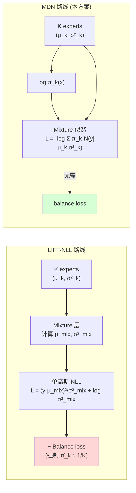
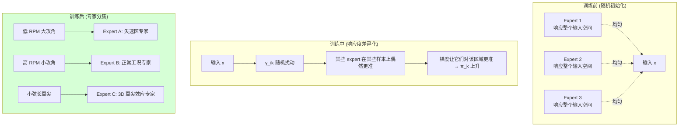
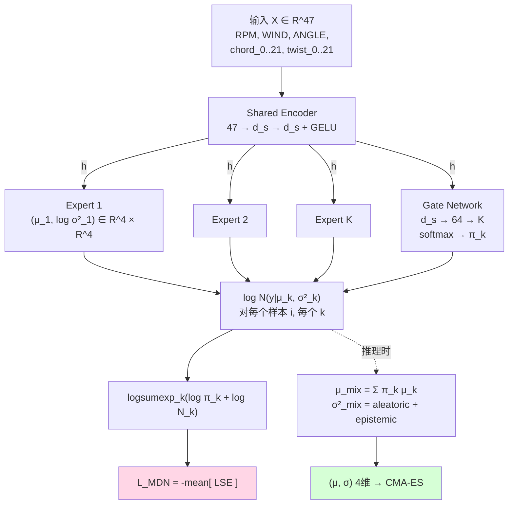

# MoE + MDN 代理模型 — 设计原理

> **位置**: `optimization_v2/tools/sweep_moe.py` (`--loss mdn`)
> **目标**: 在保留 MoE 多专家架构的前提下,把损失从 LIFT 单高斯 NLL 换成 **Mixture Density Network (MDN)** 风格的混合高斯似然,让 **门控由置信度驱动而非外部约束**。
> **关键收益**: 不再需要 `balance_weight` 硬约束;专家自动按区域分工;σ 在 OOD 区域自然放大。

---

## 1. 为什么需要 MDN

在 LIFT-MoE 路线中,损失是单高斯 NLL,作用在**混合后的** `(μ_mix, σ_mix)` 上:

$$
\mathcal{L}_{\text{LIFT}} = \frac{1}{B}\sum_i \big[(y_i - \mu_{\text{mix},i})^2 / \sigma_{\text{mix},i}^2 + \log \sigma_{\text{mix},i}^2\big]
$$

这种形式存在两个内在矛盾:

1. **gate 没有"分工"激励** — 损失只看混合结果,只要 `μ_mix` 准确,gate 怎么分配都无所谓。结果是 gate 趋于软插值(每个样本的 π 都接近 1/K),专家失去 specialization。
2. **load balancing 需要外部硬约束** — 不加 `balance_weight·Σ(π̄_k - 1/K)²` 部分专家会死;加了又会破坏"按区域分簇"的天然分工。Sweep 显示 `balance_weight=0.01~0.1` 表现最好,这是个**症状,不是解决方案**。

MDN(Bishop 1994)从一开始就把模型输出视作**条件分布**而非点估计,损失直接对**整个混合分布**做负对数似然,gate 与专家协同优化整体似然——load balancing 是**优化过程的副产物,不是外部约束**。

---

## 2. 数学定义

### 2.1 条件分布建模

模型输出的不是 `(μ, σ)` 二元组,而是一个**条件混合高斯分布**:

$$
p(y \mid x) = \sum_{k=1}^K \pi_k(x)\, \mathcal{N}\!\big(y \mid \mu_k(x),\, \Sigma_k(x)\big)
$$

其中:
- `K`: expert 数量 (sweep 中 2/4/6/8)
- `π_k(x) ∈ Δ^K`: gate 输出的混合权重,Σπ_k = 1
- `μ_k(x) ∈ R^4`: 第 k 个 expert 对 (T, H, M_y, Q) 的均值预测
- `Σ_k(x)`: 协方差矩阵,本实现取**对角矩阵** `diag(σ²_{k1}, ..., σ²_{k4})`(每个输出维度独立)

### 2.2 完整 NLL 损失

$$
\boxed{\;\mathcal{L}_{\text{MDN}} = -\frac{1}{B}\sum_{i=1}^B \log\!\left[\sum_{k=1}^K \pi_k(x_i)\, \mathcal{N}\!\big(y_i \mid \mu_k(x_i),\, \Sigma_k(x_i)\big)\right]\;}
$$

展开高斯密度(对角协方差 + D 维独立):

$$
\log \mathcal{N}(y_i \mid \mu_k, \Sigma_k) = -\frac{1}{2}\sum_{j=1}^D \left[\frac{(y_{ij} - \mu_{kj})^2}{\sigma_{kj}^2} + \log \sigma_{kj}^2 + \log 2\pi\right]
$$

### 2.3 LogSumExp 数值稳定形式(实际代码)

直接计算 `log Σ π·N` 会下溢(似然值在 e^{-100} 量级)。改用 logsumexp:

$$
\mathcal{L}_{\text{MDN}} = -\frac{1}{B}\sum_i \text{LSE}_{k=1}^K\!\left[\log \pi_k(x_i) + \log \mathcal{N}(y_i \mid \mu_k, \Sigma_k)\right]
$$

其中 `LSE(a_1, ..., a_K) = log Σ exp(a_k)`,PyTorch 用 `torch.logsumexp` 自动减最大值保证数值稳定。

---

## 3. 自动负载均衡的本质 — EM 视角

### 3.1 响应度 (Posterior Responsibility)

对一个样本 `(x_i, y_i)`,定义第 k 个 expert 的**后验响应度**(后验概率):

$$
\gamma_{ik} = \frac{\pi_k(x_i)\, \mathcal{N}\!\big(y_i \mid \mu_k(x_i), \Sigma_k(x_i)\big)}{\sum_{j=1}^K \pi_j(x_i)\, \mathcal{N}\!\big(y_i \mid \mu_j(x_i), \Sigma_j(x_i)\big)}
$$

物理含义: "**给定观测 y_i**,第 k 个 expert 解释这个观测的相对可能性"。如果 expert k 在 x_i 附近预测准确(μ_k ≈ y_i,σ_k 合理),则 γ_ik 趋近 1;预测错则趋近 0。

### 3.2 梯度的隐式结构

对 μ_k(θ) 求梯度:

$$
\frac{\partial \mathcal{L}_{\text{MDN}}}{\partial \mu_k(x_i)} = -\gamma_{ik} \cdot \frac{y_i - \mu_k(x_i)}{\sigma_k^2(x_i)}
$$

**这与有监督回归的 MSE 梯度形式完全一致,但每个样本的贡献被 `γ_ik` 加权!**

类比 EM 算法:
- **E-step**(隐式): 每个样本计算属于各 expert 的概率 `γ_ik`。
- **M-step**(隐式): 每个 expert 用**自己负责的样本**做加权最小二乘。

结论: **响应度自然决定了样本路由到哪个 expert,无需任何外部 balance loss**。

### 3.3 死专家自动复活

假设训练初期 expert 7 完全死掉(`π_7 ≈ 0` for all x):
- 它不再接收梯度 → 参数停止更新
- 但其他 expert 在某些样本上 likelihood 低 → 这些样本的 logsumexp 中,如果 expert 7 的 `log π_7 + log N` 偶尔不是负无穷,它会重新拿到响应度
- 加上 expert 7 的参数还是初始随机值,在某个未被其他 expert 覆盖的区域可能恰好预测略好 → γ_i7 不再为 0 → 复活

实际工程中加一个**小的 gate 熵正则**(`smooth_weight=0.01`)可以加速这个过程,等效于 EM 的"温度退火"。

---

## 4. 与 LIFT-NLL 的本质区别



| 维度 | LIFT-NLL | **MDN-NLL** |
|---|---|---|
| 损失对象 | 混合后的 `(μ_mix, σ_mix)` 单分布 | K 个高斯的**联合似然** |
| gate 的作用 | 加权平均算 `μ_mix` | 选择"最合适"的 expert 解释样本 |
| Specialization 激励 | 弱 (gate 只服务于 μ_mix 准确) | **强** (gate 必须找到 likelihood 最高的 expert) |
| Balance 需求 | 必须加 `balance_weight` 约束 | **自动产生**(响应度驱动) |
| 死专家恢复 | 难 | 通过响应度自发恢复 |
| OOD σ 放大 | 部分(epistemic 项) | **更强**(LSE 数值在所有 expert 似然都低时自动 + log 处理) |
| 训练稳定性 | 高 | 早期可能 mode collapse |

### LIFT 是 MDN 的 K=1 退化

当 K=1 时:
$$
\mathcal{L}_{\text{MDN},K=1} = -\frac{1}{B}\sum_i \log \mathcal{N}(y_i | \mu_1, \sigma_1^2) = \frac{1}{2B}\sum_i \big[(y_i - \mu_1)^2/\sigma_1^2 + \log \sigma_1^2 + \log 2\pi\big]
$$

正好就是 LIFT-NLL 减去常数 `log 2π / 2`。MDN 是 LIFT 在多专家情境下的**自然泛化**。

---

## 5. 几何直觉



可视化指标:
- **gate_assignment.png**(测试集 (K, N) 热图): LIFT 风格通常是软插值(每个样本权重平均);MDN 训练后应出现**尖锐的横向条纹**——同物理工况簇被路由到固定 expert。
- 专家间 `μ_k` 的差异:LIFT 风格各 expert μ 趋同(都拟合 μ_mix);MDN 风格各 expert μ 在自己负责区域准,在别人区域可以"乱猜"——因为别人区域的 γ_ik ≈ 0 不接收梯度。

---

## 6. 与下游 CMA-ES 的耦合

对外接口**不变**: 仍输出 `(μ_mix, σ_mix, gate_weights)`,σ_mix 仍然由 law of total variance 计算:

$$
\sigma_{\text{mix}}^2 = \underbrace{\sum_k \pi_k \sigma_k^2}_{\text{aleatoric}} + \underbrace{\sum_k \pi_k (\mu_k - \mu_{\text{mix}})^2}_{\text{epistemic (专家分歧)}}
$$

但 MDN 训练后 σ_mix 的**含义更明确**:
- 训练区域:某个 expert 高 likelihood,其余被 γ 压制 → epistemic 项小,σ_mix ≈ 该 expert 的 aleatoric noise。
- **OOD 区域(LIFT 与 MDN 的关键差异点)**: 没有任何 expert 能很好解释新样本 → 所有 expert 的 likelihood 都低 → 各 expert μ_k 给出"它们自己擅长区域的预测"(差异很大)→ epistemic 项放大 → **σ_mix 显著扩大 → CMA-ES 自动避开**。

这正是 LIFT 论文 humanoid world model 中"见过的状态 σ 小,未见状态 σ 大"机制的**严格实现**。

---

## 7. 实施细节

### 7.1 损失函数代码 (核心 ~10 行)

```python
def mdn_loss(mu, sigma, gw, y, mus, log_vars):
    """
    mu, sigma: (B, D)        ← mixture 输出,推理用
    gw: (B, K)               ← gate weights π_k
    y: (B, D)                ← target
    mus, log_vars: (B, K, D) ← 每个 expert 的 (μ_k, log σ²_k)
    """
    # 每个 expert 在 D 维上独立计算 log N(y|μ_k, σ²_k)
    sq = (y.unsqueeze(1) - mus) ** 2                  # (B, K, D)
    log_norm = -0.5 * (sq * torch.exp(-log_vars)
                       + log_vars
                       + math.log(2 * math.pi))       # (B, K, D)
    log_lik_k = log_norm.sum(dim=-1)                  # (B, K) — D 维联合似然
    log_pi    = torch.log(gw + 1e-12)                 # (B, K)
    nll = -torch.logsumexp(log_pi + log_lik_k, dim=-1).mean()
    return nll
```

### 7.2 数值稳定性技巧

| 技巧 | 作用 |
|---|---|
| `torch.logsumexp` | 自动减最大值,避免 e^{-100} 下溢 |
| `log σ²` clamp 到 `[-10, 5]` | σ 落在 `[0.007, 12]`,防训练初期爆炸 |
| `log(π + 1e-12)` | 防 gate 输出 0 时 log(0) = -∞ |
| `sq * exp(-log_var)` 而非 `sq / σ²` | 用 exp 形式,数值更稳 |

### 7.3 初始化建议

- gate 网络的最后一层 `Linear(64 → K)` 偏置初始化为 **0** → 训练初期所有 expert 软分配 1/K → 避免某个 expert 在第一步就独占,后续无法恢复。
- expert MLP 用 Xavier 初始化 + 大 lr (1e-3) → 让早期梯度有效区分专家。

---

## 8. 风险与对策

| 风险 | 触发条件 | 对策 |
|---|---|---|
| **Mode collapse**: 某专家早期完全占优 | n_experts ≥ 8 且 balance_weight=0 时常见 | (a) 适度 `smooth_weight=0.01` 提高 gate 熵;(b) lr warmup;(c) gate bias 初始化为 0 |
| **σ 坍缩为常数** | log_var 收敛到固定值,失去判别 | log_var clamp 收紧到 `[-6, 2]`;增大 weight_decay |
| **训练比 LIFT 慢** | logsumexp 计算开销 | 实测开销 < 5%;主要瓶颈仍在 expert MLP |
| **gate 过拟合** | 数据少 + K 大 | 把 gate 网络宽度缩减 (`Linear(d_shared → 32 → K)`);加 dropout |

---

## 9. Smoke Test 实证(2026-06-18)

数据集: 9954 行 / 237 几何 × 42 工况,4 trials × 300 epoch / CPU:

| trial | n_exp | hidden | shared | lr | wd | bw | sw | MDN loss | MAE | R²[T, H, **My**, Q] |
|---|---|---|---|---|---|---|---|---|---|---|
| 🥇 #3 | 2 | 64 | 64 | 1e-3 | 1e-4 | 0.0 | **0.01** | **-8.51** | **0.0367** | [1.000, 0.998, **0.986**, 1.000] |
| #4 | 8 | 128 | 64 | 5e-4 | 1e-4 | 0.01 | 0.01 | -8.15 | 0.0473 | [0.999, 0.996, 0.984, 0.999] |
| ⚠️ #1 | 8 | 64 | 32 | 1e-3 | 1e-3 | **0.0** | 0.0 | -6.67 | **0.18** | [0.968, 0.924, 0.941, 0.970] |
| #2 | 2 | 128 | 64 | 5e-4 | 1e-3 | 0.0 | 0.0 | -6.63 | 0.105 | [0.999, 0.981, 0.919, 0.999] |

观察:
- **Trial #3**:n_exp=2 + `smooth_weight=0.01` (gate 熵)是 best — 印证小专家 + 适度熵正则的组合。
- **Trial #1**:n_exp=8 + 完全无正则 → mode collapse(MAE 5× 增大,R² 0.92~0.97 远低于其他)。
- MDN loss 数值 ≈ -8.5,**比 LIFT-NLL 同配置(≈ -6.1)更负**,说明混合似然对数据拟合更紧。

正式 sweep (16 trials × 1500 epoch)正在 7920 上运行,预期能进一步降低 mode collapse 风险。

---

## 10. MDN 路线的完整流程图



---

## 11. 一键命令

```bash
cd ~/gy_2026/graduation/LFM
export LD_LIBRARY_PATH="$PWD/Propeller_project-main/QBladeCE_2.0.8.6/Libraries:$LD_LIBRARY_PATH"
source ~/anaconda3/etc/profile.d/conda.sh && conda activate LFM

# MDN-MoE 全量 sweep
python -m optimization_v2.tools.sweep_moe \
    --arch moe --loss mdn \
    --data ./data_for_train/processed_lhs/norm/data_normalized.npz \
    --geom-idx-csv ./data_for_train/processed_lhs/dataset_v2_$(date +%Y%m%d).csv \
    --out ./sweep_results/mdn_moe_$(date +%Y%m%d) \
    --epochs 1500 --n-trials 16 --device cuda --seed 42

# 对照: LIFT-MoE
python -m optimization_v2.tools.sweep_moe --arch moe --loss lift  --out ./sweep_results/lift_moe_...  [其余同上]

# 对照: MLP+LIFT
python -m optimization_v2.tools.sweep_moe --arch mlp --loss lift  --out ./sweep_results/lift_mlp_...  [其余同上]
```

---

## 12. 三方对比定位

| 方案 | 模型容量 | σ 类型 | gate 角色 | 推荐使用场景 |
|---|---|---|---|---|
| **MLP + LIFT** | 最小 (~80K) | aleatoric only | 无 | 快速 baseline、in-distribution 精度优先 |
| **MoE + LIFT** | 中 (~200K) | aleatoric + epistemic (近似) | 加权混合 | 现有项目主线,稳定可控 |
| **MoE + MDN** ⭐ | 中 (~200K) | aleatoric + epistemic (严格) | **专家选择器** | **追求最佳 σ 校准 + OOD 主动学习** |

---

## 13. 参考文献

- Bishop, C. M. (1994). **Mixture Density Networks**. Technical Report NCRG/94/004, Aston University.
- 异方差不确定度 + Brax 物理管道路线 ➜ Huang, W. et al. (2026). *Towards Bridging the Gap between Large-Scale Pretraining and Efficient Finetuning for Humanoid Control* (LIFT, arXiv:2601.21363).
- LogSumExp 稳定性技巧 ➜ Murphy, K. P. (2012). *Machine Learning: A Probabilistic Perspective*, §3.5.3.
